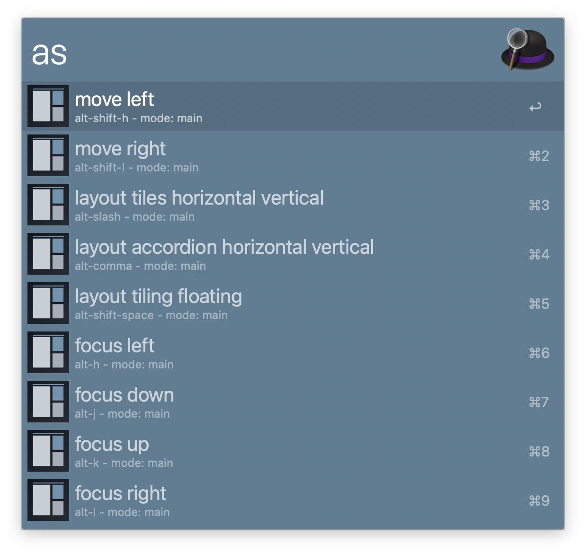
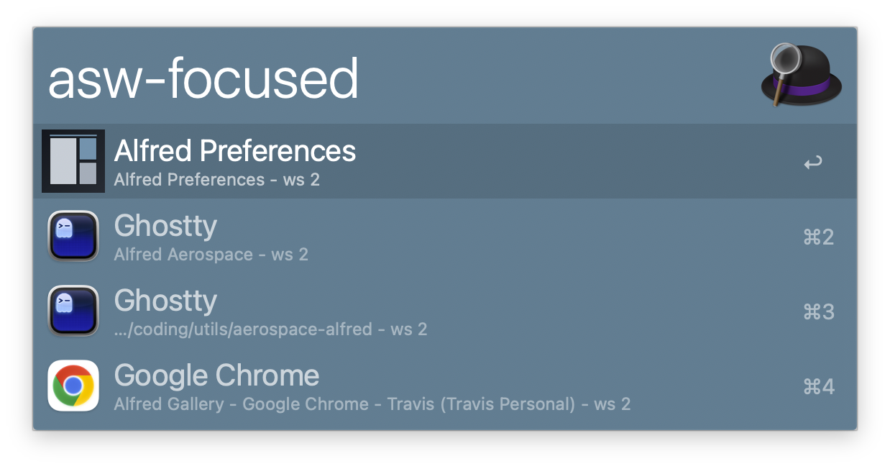
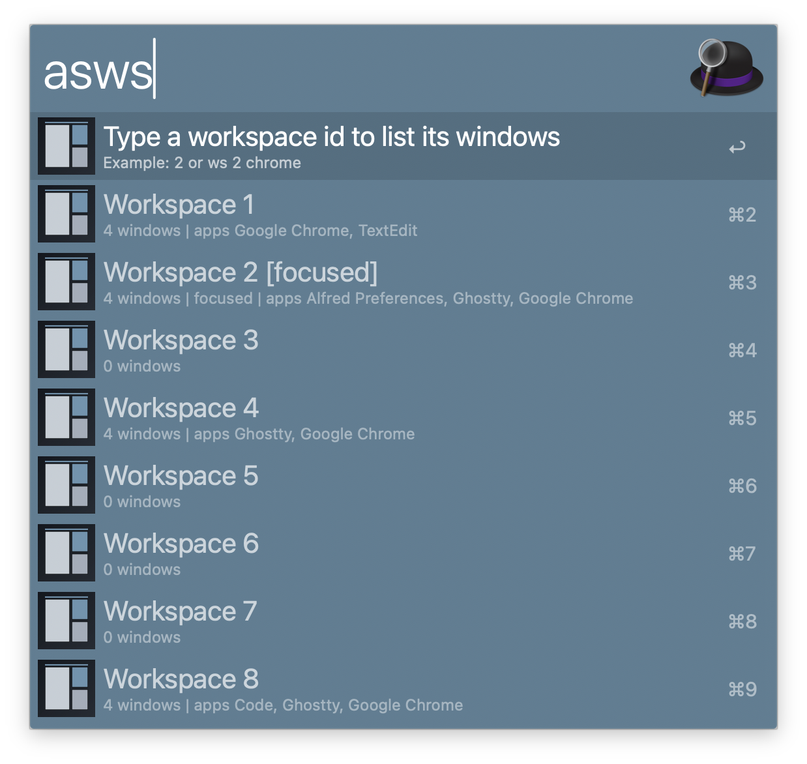
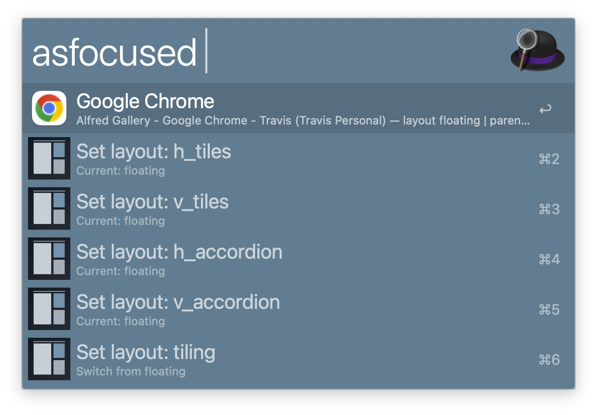

# AeroSpace Alfred Workflow

Alfred workflow for the AeroSpace window manager. It lists shortcuts from your config, executes them via AppleScript, and provides window switching and workspace overview tools.

## Setup

Install [AeroSpace](https://github.com/nikitabobko/AeroSpace) and grant Alfred Accessibility permission to allow shortcut execution.

## Usage

Search and execute AeroSpace shortcuts (keyword is configurable in workflow settings) via the `as` keyword.

Commands (keywords are configurable):

- `as` — list shortcuts
- `ascfg` — open config
- `asw` — windows (default scope)
- `asw-all` — windows (all)
- `asw-focused` — windows (focused)
- `asws` — workspace overview
- `asfocused` — focused window details

Alternatively, switch windows in the focused workspace via the `asw-focused` keyword.

Alternatively, switch windows using the default scope via the `asw` keyword.

Alternatively, switch windows across all workspaces via the `asw-all` keyword.

Alternatively, browse workspaces and their windows via the `asws` keyword.

Alternatively, inspect the focused window and change layout via the `asfocused` keyword.

## Workflow’s Configuration

- Default Workspace: choose focused or all workspaces for `asw`.
- Notifications: toggle notifications after shortcut execution.
- Keywords: all keywords are configurable in workflow settings.

## Notes

- AeroSpace CLI must be available on PATH.
- Notifications require Alfred’s Notifications permission if enabled.

## Credits

Initially built to match the behavior of the [AeroSpace Raycast extension](https://www.raycast.com/limonkufu/aerospace).
